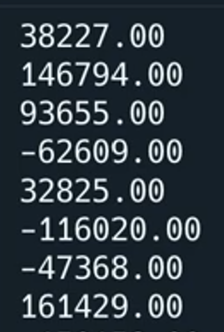

# Comma-Separated Values

CSV files are a way of storing a spreadsheet as a text file. Every value in the file is separated by a comma.

Hence the name...

Look, it's basically a spreadsheet.


## Opening A CSV File

Fortunately, CSV files are so common that Python already has built-in libraries for working with them.

👉 The csv file 'January.csv' has been added for you. Let's see what happens:


```python
import csv # Imports the csv library

with open("January.csv") as file: # Opens the csv file
  reader = csv.reader(file) # reads the contents of the csv file into the 'reader' variable
  line = 0

  for row in reader: # loop to output each row in the 'reader' variable one at a time.
    print (row)
```

This works, but the output isn't very pretty. And we like pretty.


## Make it Beautiful!
👉 Let's use `join`. It allows us combine lists in a more interesting way.
```python
import csv 

with open("January.csv") as file: 
  reader = csv.reader(file) 
  line = 0

  for row in reader: 
    print (", ".join(row)) # adds a comma and space and then joins data, you could try joining with tabs too with `\t`
```


## Filter the Output

👉 The trick is to treat the CSV like a dictionary, using the `csv.DictReader()` function. In the code below, I've filtered it so that it only shows the net total from each day.

```python
import csv # Imports the csv library

with open("January.csv") as file: 
  reader = csv.DictReader(file) # Treats the file as a dictionary 
  line = 0
  for row in reader: 
    print (row["Net Total"])
```


👉 Now let's see if we can add the net totals from each day to create a total. Note that I've cast the data as a float because our library will treat it as text.

```python
import csv # Imports the csv library

with open("January.csv") as file: 
  reader = csv.DictReader(file) # Treats the file as a dictionary 
  line = 0
  for row in reader: 
    print (row["Net Total"])
    total += float(row["Net Total"]) # Keeps a running total

print(f"Total: {total}") #Outputs 
```

### Try it out!