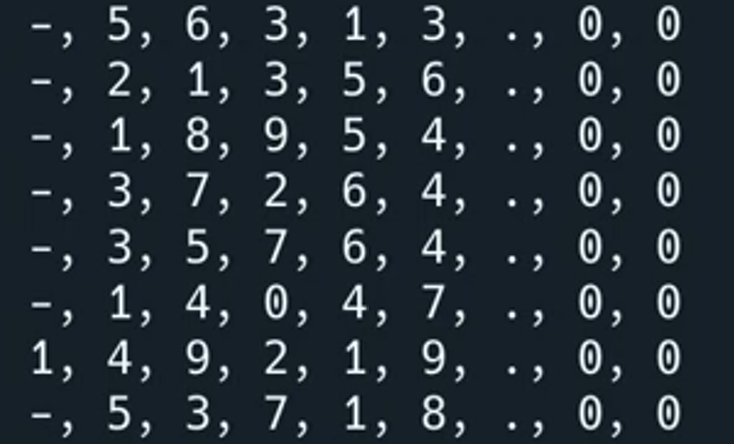

# Common Errors

*First, delete any other code in your `main.py` file. Copy each code snippet below into `main.py` by clicking the copy icon in the top right of each code box. Then, hit `run` and see what errors occur. Fix the errors and press `run` again until you are error free. Click on the `👀 Answer` to compare your code to the correct code.*

👉 What's the problem here?


```python
import csv # Imports the csv library

with open("January.csv") as file: 
  reader = csv.DictReader(file) 
  line = 0
  
  for row in reader: 
    print (row["Net Total"])
    total += row["Net Total"] 

print(f"Total: {total}") 
```

<details> <summary> 👀 Answer </summary>

- Data read is treated as text. To perform calculations, we need to cast it. In this case, as a float.

```python
import csv # Imports the csv library

with open("January.csv") as file: 
  reader = csv.DictReader(file) 
  line = 0
  
  for row in reader: 
    print (row["Net Total"])
    total += float(row["Net Total"])

print(f"Total: {total}") 
```

</details>


👉 What is the problem here?
```python
import csv # Imports the csv library

with open("January.csv") as file: 
  reader = csv.DictReader(file) 
 
  
  for row in reader: 
    print (", ".join(row["Net Total"]))
    total += float(row["Net Total"])

print(f"Total: {total}") 
```
Did you get this output?


<details> <summary> 👀 Answer </summary>

The join command has been applied to a string. It's joining those individual characters with a comma between each one.

This won't break your code, just make the output look a bit weird. Removing the `join()` command fixes this.

```python
import csv # Imports the csv library

with open("January.csv") as file: 
  reader = csv.DictReader(file) 
 
  
  for row in reader: 
    print(row["Net Total"])
    total += row["Net Total"] 

print(f"Total: {total}") 
```


</details>

